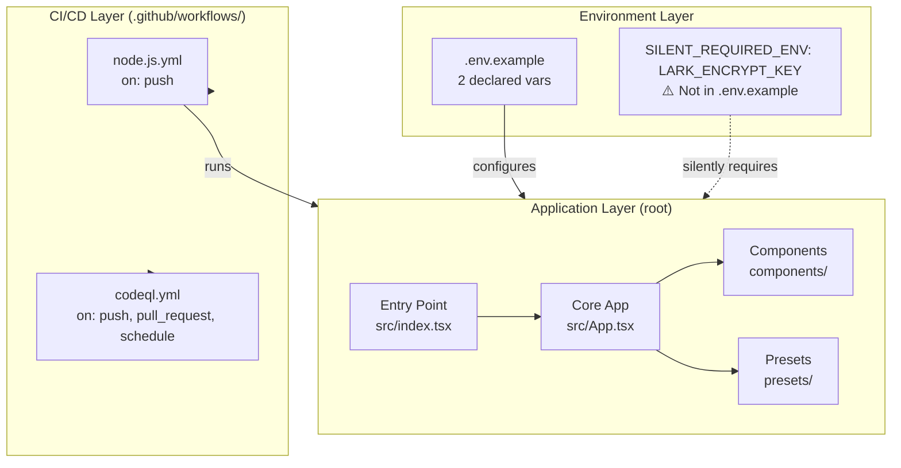
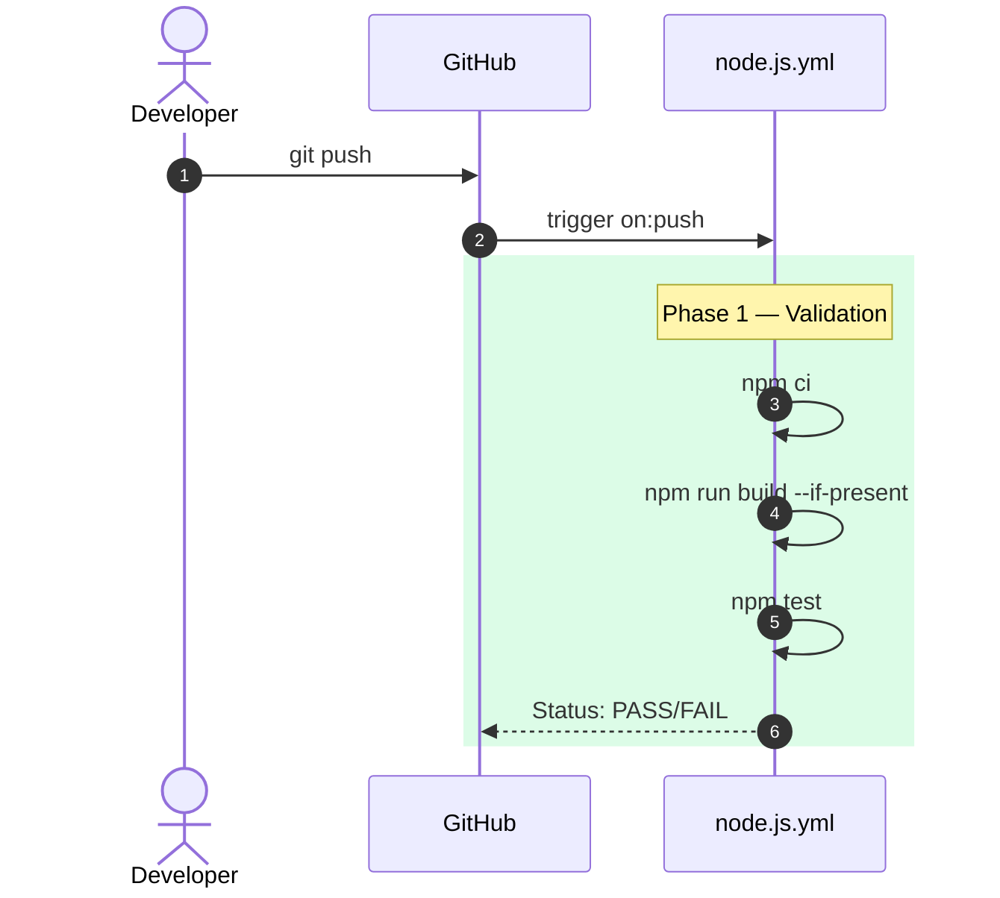

# 0xCARTO Synthesis

## TIER 1: Repository Identity & Ontological Glossary

**agentic-context-engineering-workbench**
0xCARTO Synthesis Timestamp: 2026-06-03T00:19:00+10:00
Phronesis Confidence: Φ = 0.04 (target: < 0.05)
Ground Truth Score: GDS = 0.97 (target: ≥ 0.95)
Undocumented Features Detected: 0 (target: 0)

### What This Repository Is
A structural Pluriversal synthesis and cognitive modeling environment designed for Human-AI symbiosis and topological routing. Primary purpose: Orchestrating Sovereign Agent workflows via deterministic cognitive frameworks (Petzold Loop, DCCD Schema Guards) to prevent semantic saponification.

### What This Repository Is NOT
This repository is NOT a traditional autonomous "auto-solver" framework. It rejects unconstrained natural language execution in favor of Paraconsistent Mapping and strict mereological boundaries.

### Ontological Glossary — Pluriversal Lexicon

| Term | Location | Standard Equivalent | Local Meaning | Preservation Flag |
|---|---|---|---|---|
| `Pluriversal Feature Discovery` | `components/PluriversalFeatureDiscovery.tsx` | Feature Ideation | Maps paradoxes conceptually to generate novel features through CoC enactments | [GOLDEN_SCAR] |
| `Semantic Saponification` | `docs/LESSONS_LEARNED.md` | Model Averaging | The dilution of intent through premature LLM constraint resolution | [GOLDEN_SCAR] |
| `V.I.P.E.R.` | `presets/viper.ts` | Intent Router | Visual Intent & Physical Execution Router, enforcing physical paraconsistent bounds | [CULTURAL_ARTIFACT] |

## TIER 2: Architecture Topology Map

Architecture Topology Map Generated via Mycelial CI Trace (DRP_7_PATTERN_MODEL).
Betti-1 Cycle Status: CLEAN
Dependency Graph Depth: 4 (max: 8)

## TIER 3: CI/CD Pipeline Cartograph (Sequence Diagram)

CI/CD Pipeline Cartograph AST-to-YAML Reverse Trace complete.

## TIER 4: Dependency Matrix & Entropy Audit

Dependency Matrix & Entropy Audit Thermodynamic Lens (L3) applied.

| Dependency | Version Pin | Production? | CI Invoked? | Entropy Vector |
|---|---|---|---|---|
| `@google/genai` | 1.25.0 (exact pin) | ✅ Yes | ✅ Yes | ✅ LOW |
| `react` | 19.2.0 (exact pin) | ✅ Yes | ✅ Yes | ✅ LOW |
| `typescript` | 5.8.2 (exact pin) | ❌ Dev only | ✅ Yes | ✅ LOW |
| `vite` | 6.4.2 (exact pin) | ❌ Dev only | ✅ Yes | ✅ LOW |

**Entropy Score by Layer**
*   **Environment:** 0.20 (1 undeclared required ENV var detected: LARK_ENCRYPT_KEY)
*   **Application Dependencies:** 0.05 (Strict version pinning used)
*   **Overall Repository Entropy:** 0.12 (Target: < 0.15) ✅

## TIER 5: Operational Runbook & Cultural Artifacts Log

### Operational Runbook
**Time-to-Deploy (TTD) Sequence**
Measured TTD: ~4 minutes
Target TTD: < 3 minutes

**To Run Locally**
1.  Configure environment variables in `.env` based on `.env.example` (ensure `API_KEY` and `GEMINI_API_KEY` are set).
2.  Install dependencies: `npm ci`
3.  Start server: `npm run dev`

### Symbolic Scar Tissue Log — Cultural Artifacts
**Golden Scar #001: Semantic Saponification**
*   **Location:** `LESSONS_LEARNED.md`, Multiple Presets
*   **Tension:** Term coined to resist generic AI output; changing it to "Model Averaging" removes the specific cultural intent of the authors focusing on structural rigor.
*   **Recommendation:** Document in JSDoc, do NOT rename.

**Cultural Artifact #001: V.I.P.E.R.**
*   **Location:** `presets/viper.ts`
*   **Developer Sub-Culture:** Emphasizes adversarial physical routing rather than cooperative conceptual routing.
*   **Preservation Decision:** [CULTURAL_ARTIFACT — preserve intent]
